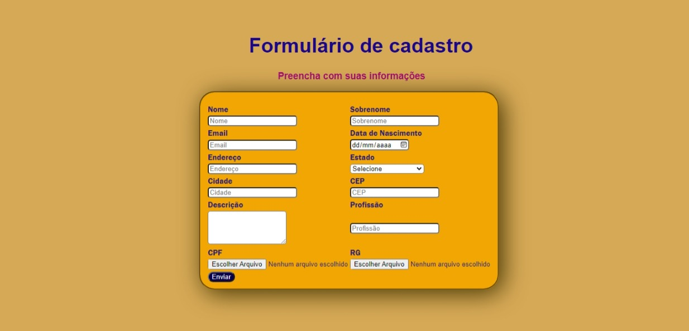

# Formulário de cadastro 💻
<h3> 📄📎 Este arquivo possui página única de formulário, estilizado com CSS3.</h3>
                          
## Documentos: 
- [Formulário](./Paginas/formulario.html) 
<h1 align="center"></h1>